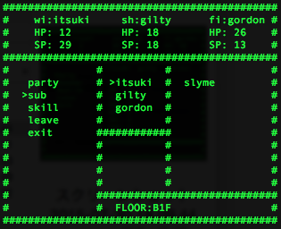

# 3D-RPG
Wizardlyとドラクエが混ざったようなダンジョンRPG

# 説明

## ゲーム画面

### ロビー画面

今実装している部分は
- MONSTERHOUSE:モンスターを管理できます。
- DUNGEON:ダンジョン探索に出かけます。
- SAVE:データをセーブします。セーブデータ3つまで作れます。
- LOAD:セーブデータをロードします。
- EXIT:ゲームを終了します。
だけです。

他は押しても何も起こりません。
セーブデータはバイナリファイルとして生成します。

### ダンジョン画面

ダンジョンは3D風に進みます。ダンジョン探索中に
- m:マップ（マップ中の「>」は現在地と向きです）
- s:ステータス画面
を表示します

### バトル画面

バトル画面では最大3体の敵がでます。
攻撃の順番は敵3体味方3体、計6体の素早さの早い順になっています。

敵を倒すと確率で仲間になってくれます。同じ敵は仲間になる確率が低くなります。
### ステータス画面

- party:パーティのステータスを見れます。
- sub:味方のキャラ全てが見れます。仲間にしたモンスターもここでパーティに入れることができます
- skill:パーティの特技を見れます。
- leave:仲間にしたモンスターと別れます。
- exit:ステータス画面を終わります。

パーティのステータスを見ている途中などは
- q:戻る
となっています。

##操作方法
ロビー画面やステータス画面中では
- f:上
- j:下
- スペース:決定

ダンジョン探索中は
- f:左
- j:右
- スペース:前進

となります。
